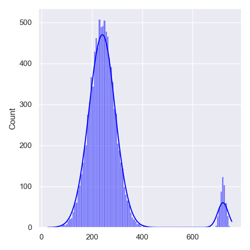
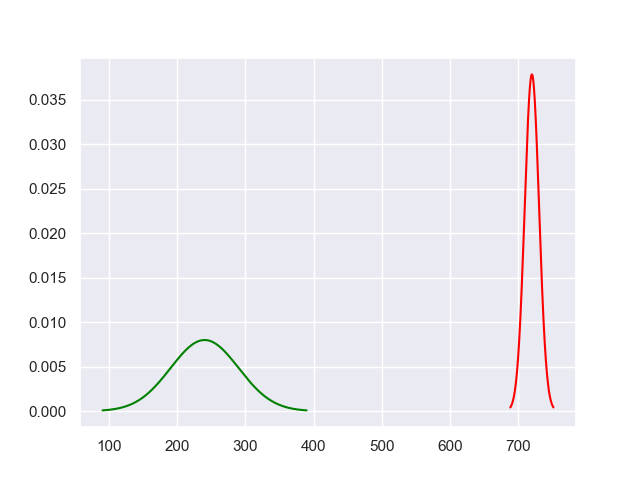

# disjoin
Separate a mixed set into its constituents.

## Dataset
The data is generated as two sets, intended to model 
program runs which ran to normal completion and 
a smaller subset which had a problem.



Because we cannot say anything concrete about the problem set 
we have to use statistics.  
Because the two sets have such differing means we can split the dataset 
easily using a built-in library function ```GaussianMixture```.


